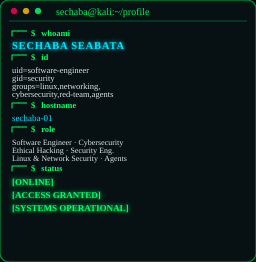
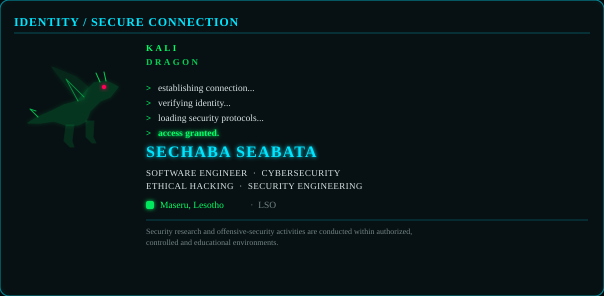
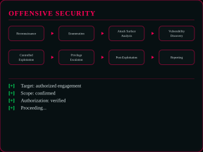
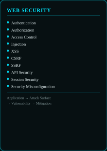
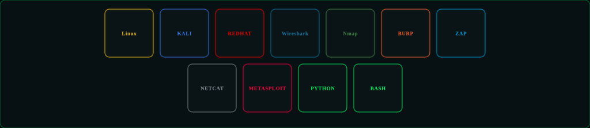
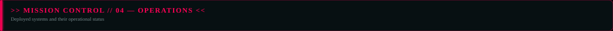

# SECHABA.OS

**SECHABA SEABATA** — Software Engineer · Cybersecurity · Ethical Hacking · Security Engineering · Linux & Network Security · Agentic Engineering

Maseru, Lesotho 🇱🇸 — building web applications, real-world software systems, and automating engineering workflows with AI.

[ Portfolio ](https://sechabaseabataportfolio.netlify.app) · [ Email ](mailto:seabatasechaba0@gmail.com) · [ Profile ](https://github.com/hitman1c)

Security research and offensive-security activities are conducted within authorized, controlled, and educational environments.

---

<table>
<tr>
<td width="212" valign="top"></td>
<td width="536" valign="top"></td>
<td width="256" valign="top"></td>
</tr>
</table>

  

<table>
<tr>
<td width="604" valign="top"></td>
<td width="406" valign="top"></td>
</tr>
</table>

---

<table>
<tr>
<td width="332" valign="top"></td>
<td width="248" valign="top"></td>
<td width="424" valign="top"></td>
</tr>
</table>

---

<table>
<tr>
<td width="332"></td>
<td width="332" valign="top"></td>
<td width="340" valign="top"></td>
</tr>
<tr>
<td></td>
<td width="220" valign="top"></td>
<td width="220" valign="top"></td>
<td width="222" valign="top"></td>
</tr>
</table>

  

---

<table>
<tr>
<td width="332" valign="top">
  
  
  
</td>
<td width="604" valign="top"></td>
</tr>
</table>

---

<table>
<tr>
<td width="328" valign="top"></td>
<td width="328" valign="top"></td>
<td width="348" valign="top"></td>
</tr>
</table>

  

---

  

---

---

<table>
<tr>
<td width="604" valign="top"></td>
<td width="406" valign="top"></td>
</tr>
</table>

  
  

---

